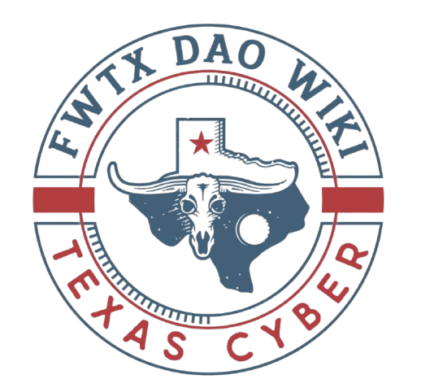

<!-- Improved compatibility of back to top link: See: https://github.com/othneildrew/Best-README-Template/pull/73 -->
<a id="readme-top"></a>

<!-- PROJECT SHIELDS -->
[![Contributors][contributors-shield]][contributors-url]
[![Forks][forks-shield]][forks-url]
[![Stargazers][stars-shield]][stars-url]
[![Issues][issues-shield]][issues-url]
[![MIT License][license-shield]][license-url]
[![LinkedIn][linkedin-shield]][linkedin-url]

<!-- PROJECT LOGO -->
<br />
<div align="center">
  <a href="https://github.com/FWTX-DAO/fwtx-wiki-engine">
    
  </a>

<h3 align="center">Fort Worth Wiki Engine</h3>

  <p align="center">
    A knowledge graph-based wiki for Texas municipal information, powered by GraphRAG and implementing the Texas Ontology Protocol (TOP)
    <br />
    <a href="https://github.com/FWTX-DAO/fwtx-wiki-engine/tree/main/artifacts"><strong>Explore the docs »</strong></a>
    <br />
    <br />
    <a href="https://github.com/FWTX-DAO/fwtx-wiki-engine">View Demo</a>
    &middot;
    <a href="https://github.com/FWTX-DAO/fwtx-wiki-engine/issues/new?labels=bug&template=bug-report---.md">Report Bug</a>
    &middot;
    <a href="https://github.com/FWTX-DAO/fwtx-wiki-engine/issues/new?labels=enhancement&template=feature-request---.md">Request Feature</a>
  </p>
</div>

<!-- TABLE OF CONTENTS -->
<details>
  <summary>Table of Contents</summary>
  <ol>
    <li>
      <a href="#about-the-project">About The Project</a>
      <ul>
        <li><a href="#built-with">Built With</a></li>
      </ul>
    </li>
    <li>
      <a href="#getting-started">Getting Started</a>
      <ul>
        <li><a href="#prerequisites">Prerequisites</a></li>
        <li><a href="#installation">Installation</a></li>
      </ul>
    </li>
    <li><a href="#usage">Usage</a></li>
    <li><a href="#texas-ontology-protocol">Texas Ontology Protocol (TOP)</a></li>
    <li><a href="#roadmap">Roadmap</a></li>
    <li><a href="#contributing">Contributing</a></li>
    <li><a href="#license">License</a></li>
    <li><a href="#contact">Contact</a></li>
    <li><a href="#acknowledgments">Acknowledgments</a></li>
  </ol>
</details>

<!-- ABOUT THE PROJECT -->
## About The Project

Fort Worth Wiki provides citizens with intelligent access to Fort Worth municipal information through state-of-the-art Knowledge Graph Retrieval-Augmented Generation (GraphRAG). This project introduces the **Texas Ontology Protocol (TOP)**, a standardized framework for modeling Texas municipal and county government structures in knowledge graphs.

### Key Features:
- **Temporal Knowledge Graph**: Bi-temporal data model tracking both event occurrence and data recording times
- **Texas-Specific Ontology**: Models home-rule cities, council-manager government, and Texas Local Government Code structures
- **GraphRAG-Powered Search**: Combines graph traversal with LLM-based retrieval for intelligent query responses
- **Entity Resolution**: Automatic deduplication using embeddings and similarity search
- **Open Source Protocol**: TOP provides a reusable standard for any Texas municipality

<p align="right">(<a href="#readme-top">back to top</a>)</p>

### Built With

* [![Python][Python]][Python-url]
* [![FastAPI][FastAPI]][FastAPI-url]
* [![FalkorDB][FalkorDB]][FalkorDB-url]
* [![Graphiti][Graphiti]][Graphiti-url]
* [![Google AI][GoogleAI]][GoogleAI-url]

<p align="right">(<a href="#readme-top">back to top</a>)</p>

<!-- GETTING STARTED -->
## Getting Started

To get a local copy up and running follow these simple steps.

### Prerequisites

* Python 3.13+
* Docker (for FalkorDB)
* uv (recommended for Python package management)
  ```sh
  curl -LsSf https://astral.sh/uv/install.sh | sh
  ```

### Installation

1. Clone the repo
   ```sh
   git clone https://github.com/FWTX-DAO/fwtx-wiki-engine.git
   cd fwtx-wiki-engine
   ```

2. Install Python dependencies
   ```sh
   uv sync
   ```

3. Set up environment variables
   ```sh
   cp .env.example .env
   ```
   Edit `.env` and add your:
   - `OPENAI_API_KEY` (required for embeddings/LLM)
   - Optional: API authentication key, PostgreSQL settings

4. Start FalkorDB
   ```sh
   docker run -p 6379:6379 -p 3000:3000 -it --rm falkordb/falkordb:latest
   ```

5. Run the application
   ```sh
   uv run wiki.py
   ```

<p align="right">(<a href="#readme-top">back to top</a>)</p>

<!-- USAGE EXAMPLES -->
## Usage

Once running, the Fort Worth Wiki API provides endpoints for:

```python
# Search for information about Fort Worth services
GET /api/search?q=city+council+meetings

# Query the knowledge graph with natural language
POST /api/query
{
  "query": "Who is the current mayor of Fort Worth?"
}
```

### Example Queries:
- "What are the requirements for a home-rule city in Texas?"
- "Show me the city council districts and their representatives"
- "When are the next municipal elections?"
- "What ordinances were passed in the last month?"

_For more examples, please refer to the [API Documentation](http://localhost:8001/docs)_

<p align="right">(<a href="#readme-top">back to top</a>)</p>

<!-- TEXAS ONTOLOGY PROTOCOL -->
## Texas Ontology Protocol

The Texas Ontology Protocol (TOP) is a comprehensive standard for modeling Texas municipal and county government structures in knowledge graphs. It provides:

- **Standardized entity types** for Texas government structures (home-rule cities, council-manager form, etc.)
- **Temporal modeling patterns** for tracking political terms, elections, and legislative changes
- **Spatial relationships** for districts, precincts, and annexations
- **Interoperability** with W3C standards (ORG, FOAF, GeoSPARQL, OWL-Time)

See [artifacts/TOP.md](artifacts/TOP.md) for the complete specification.

<p align="right">(<a href="#readme-top">back to top</a>)</p>

<!-- ROADMAP -->
## Roadmap

- [x] Define Texas Ontology Protocol (TOP)
- [x] Implement temporal knowledge graph with FalkorDB
- [ ] Complete search API implementation
- [ ] Add data ingestion pipeline for Fort Worth data
- [ ] Implement GraphRAG query engine
- [ ] Create citizen-friendly web interface
- [ ] Extend to support multiple Texas municipalities
- [ ] Add real-time data synchronization

See the [open issues](https://github.com/FWTX-DAO/fwtx-wiki-engine/issues) for a full list of proposed features (and known issues).

<p align="right">(<a href="#readme-top">back to top</a>)</p>

<!-- CONTRIBUTING -->
## Contributing

Contributions are what make the open source community such an amazing place to learn, inspire, and create. Any contributions you make are **greatly appreciated**.

If you have a suggestion that would make this better, please fork the repo and create a pull request. You can also simply open an issue with the tag "enhancement".
Don't forget to give the project a star! Thanks again!

1. Fork the Project
2. Create your Feature Branch (`git checkout -b feature/AmazingFeature`)
3. Commit your Changes (`git commit -m 'Add some AmazingFeature'`)
4. Push to the Branch (`git push origin feature/AmazingFeature`)
5. Open a Pull Request

### Focus Areas for Contributions:
- Implementing additional Texas municipality ontologies
- Enhancing the GraphRAG query engine
- Adding more data sources and ingestion pipelines
- Improving entity resolution algorithms
- Creating visualization tools for the knowledge graph

<p align="right">(<a href="#readme-top">back to top</a>)</p>

### Top contributors:

<a href="https://github.com/FWTX-DAO/fwtx-wiki-engine/graphs/contributors">
  
</a>

<!-- LICENSE -->
## License

Distributed under the MIT License. See `LICENSE.txt` for more information.

<p align="right">(<a href="#readme-top">back to top</a>)</p>

<!-- CONTACT -->
## Contact

FWTX DAO - [@FWTXDAO](https://twitter.com/FWTX_DAO) - contact@fwtx.org

Project Link: [https://github.com/FWTX-DAO/fwtx-wiki-engine](https://github.com/FWTX-DAO/fwtx-wiki-engine)

<p align="right">(<a href="#readme-top">back to top</a>)</p>

<!-- ACKNOWLEDGMENTS -->
## Acknowledgments

* [Graphiti Core](https://github.com/getzep/graphiti) - Temporal knowledge graph framework
* [FalkorDB](https://www.falkordb.com/) - High-performance graph database
* [City of Fort Worth](https://www.fortworthtexas.gov/) - Municipal data and documentation
* [Texas Municipal League](https://www.tml.org/) - Texas government structure resources
* [Best-README-Template](https://github.com/othneildrew/Best-README-Template) - README template

<p align="right">(<a href="#readme-top">back to top</a>)</p>

<!-- MARKDOWN LINKS & IMAGES -->
<!-- https://www.markdownguide.org/basic-syntax/#reference-style-links -->
[contributors-shield]: https://img.shields.io/github/contributors/FWTX-DAO/fwtx-wiki-engine.svg?style=for-the-badge
[contributors-url]: https://github.com/FWTX-DAO/fwtx-wiki-engine/graphs/contributors
[forks-shield]: https://img.shields.io/github/forks/FWTX-DAO/fwtx-wiki-engine.svg?style=for-the-badge
[forks-url]: https://github.com/FWTX-DAO/fwtx-wiki-engine/network/members
[stars-shield]: https://img.shields.io/github/stars/FWTX-DAO/fwtx-wiki-engine.svg?style=for-the-badge
[stars-url]: https://github.com/FWTX-DAO/fwtx-wiki-engine/stargazers
[issues-shield]: https://img.shields.io/github/issues/FWTX-DAO/fwtx-wiki-engine.svg?style=for-the-badge
[issues-url]: https://github.com/FWTX-DAO/fwtx-wiki-engine/issues
[license-shield]: https://img.shields.io/github/license/FWTX-DAO/fwtx-wiki-engine.svg?style=for-the-badge
[license-url]: https://github.com/FWTX-DAO/fwtx-wiki-engine/blob/master/LICENSE.txt
[linkedin-shield]: https://img.shields.io/badge/-LinkedIn-black.svg?style=for-the-badge&logo=linkedin&colorB=555
[linkedin-url]: https://linkedin.com/in/FWTXDAO
[product-screenshot]: images/screenshot.png
[Python]: https://img.shields.io/badge/Python-3776AB?style=for-the-badge&logo=python&logoColor=white
[Python-url]: https://www.python.org/
[FastAPI]: https://img.shields.io/badge/FastAPI-009688?style=for-the-badge&logo=fastapi&logoColor=white
[FastAPI-url]: https://fastapi.tiangolo.com/
[FalkorDB]: https://img.shields.io/badge/FalkorDB-FF6B6B?style=for-the-badge&logo=redis&logoColor=white
[FalkorDB-url]: https://www.falkordb.com/
[Graphiti]: https://img.shields.io/badge/Graphiti-4A90E2?style=for-the-badge&logo=graphql&logoColor=white
[Graphiti-url]: https://github.com/getzep/graphiti
[GoogleAI]: https://img.shields.io/badge/Google_AI-4285F4?style=for-the-badge&logo=google&logoColor=white
[GoogleAI-url]: https://ai.google/